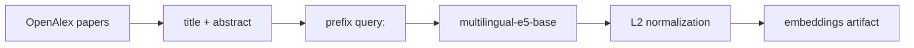

# Глава 2.2. Построение embedding статей

## Задача этапа

Преобразовать заголовок и аннотацию каждой статьи в плотный вектор фиксированной размерности.
Эмбеддинги используются в кластеризации, построении карты, метакластерах и semantic retrieval.

## Модель

В PDF используется **multilingual-e5-base**:

- размерность эмбеддинга: 768;
- вход: `query:` + title + abstract;
- корпус: 509 447 статей OpenAlex по подполю Artificial Intelligence;
- сравнение статей и авторов выполняется по косинусной близости, поэтому эмбеддинги
  L2-нормализуются.

Многоязычная модель нужна из-за смешанного корпуса OpenAlex: статьи могут быть написаны на разных
языках, но должны жить в одном embedding-пространстве.

## Пайплайн

## Результат этапа

Главные численные параметры фиксируются в PDF и таблице датасета:

| Параметр | Значение |
| --- | ---: |
| Число статей | 509 447 |
| Размерность эмбеддинга | 768 |
| Префикс | `query:` |
| Нормализация | L2 |

Точный путь к embedding artifact задаётся в коде через `common.compat.EMBEDDINGS_PATH`; порядок строк
используется как канонический индекс статей во всех последующих этапах.
