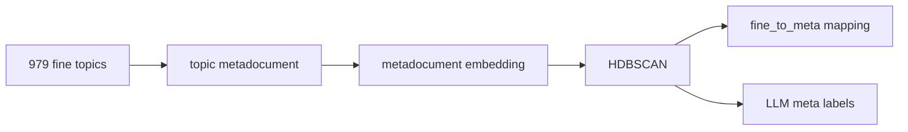

# Глава 2.4. Метакластеры — семантический overlay

## Постановка

979 fine-тем слишком детальны для навигации на дальнем зуме. Метакластеры объединяют fine-темы в
крупные смысловые группы и дают пользователю верхний слой карты.

Важно: метакластеры — это semantic overlay над темами, а не строгая геометрическая иерархия.
Статьи, fine-темы и метакластеры живут в разных пространствах, поэтому метакластеры не рисуются как
непересекающиеся области на 2D-карте.

## Как строятся метакластеры

Метадокумент темы собирается из её LLM-названия, топ-терминов и представительных статей. Затем
метадокументы кодируются и кластеризуются.

## Выбранный вариант

В PDF используется метакластерный слой с 76 метакластерами:

| Параметр | Значение |
| --- | ---: |
| Fine-тем | 979 |
| Метакластеров | 76 |
| `dup_pair_rate` | 0.000 |
| `noise_ratio` | 0.114 |
| `size_p50` | 10 |

Источники:

- `results/meta_clustering/selection_report.md`;
- `results/meta_clustering/summary_metrics.csv`;
- `results/final_tables/clustering_metacluster.csv`;
- `data/meta/meta_assignments.json`.

## Роль в рекомендациях

Метакластеры проверялись как связь между кластеризацией и recommendations:

- как признаки в Transformer-вариантах;
- как дополнительные meta-узлы в GraphSAGE.

По текущим артефактам они не дают доказанного значимого прироста retrieval: paired bootstrap для
метакластерного GraphSAGE против базового GraphSAGE включает ноль по Hit@10 и nDCG@10. Поэтому в
итоговой интерпретации метакластеры остаются прежде всего инструментом навигации и объяснения карты.
