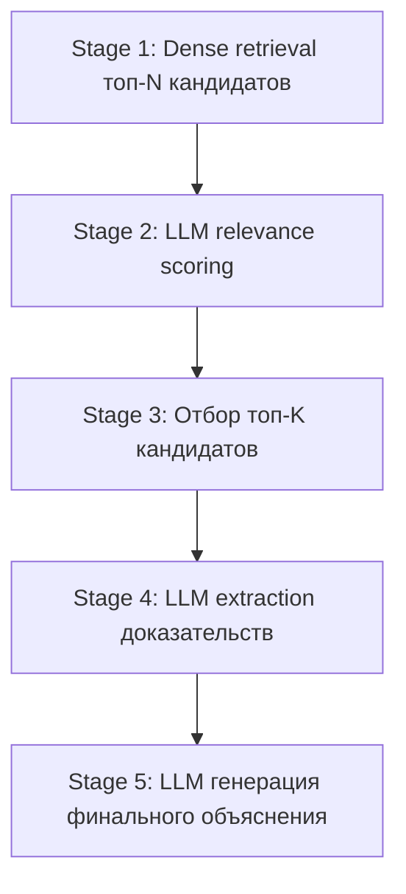
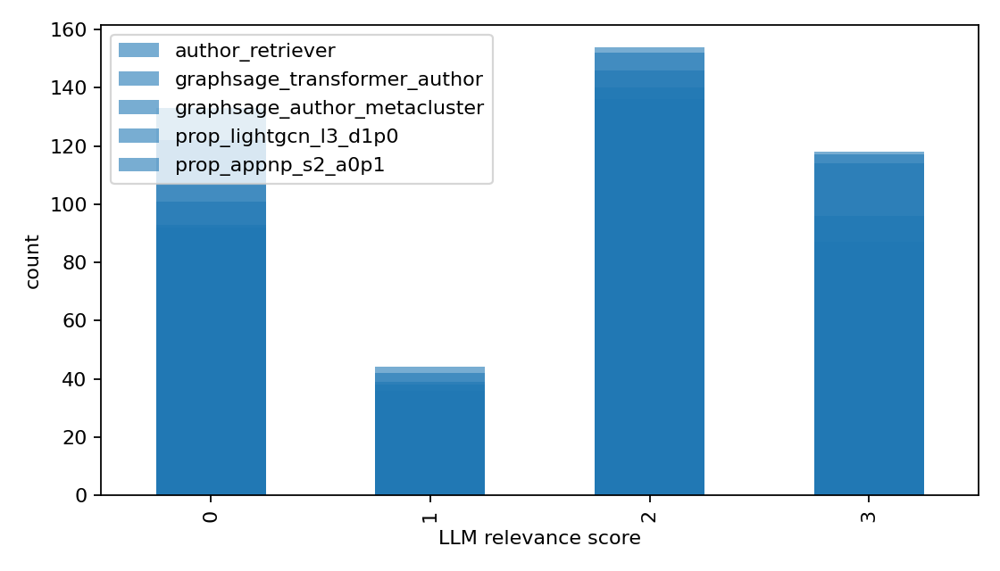

# Глава 2.6. LLM reranking и генерация объяснений

Это современная и одна из самых сильных частей работы: dense retrieval даёт быстрый, но «слепой» к
смыслу список кандидатов, а большая языковая модель переранжирует их по реальной научной релевантности
и формирует понятное объяснение.

## Пятиступенчатый pipeline



1. **Stage 1 — dense retrieval.** Топ-N (по умолчанию 20) кандидатов по близости эмбеддингов авторов
   (описано в [главе 2.5](04_author_retrieval.md)).
2. **Stage 2 — LLM relevance scoring.** Каждый кандидат независимо оценивается языковой моделью.
3. **Stage 3 — отбор.** Отбираются топ-K (по умолчанию 3) кандидатов по LLM-оценке.
4. **Stage 4 — извлечение доказательств.** Для каждого отобранного кандидата LLM находит конкретные
   попарные связи между статьями.
5. **Stage 5 — финальное объяснение.** LLM формирует итоговый текст рекомендаций со ссылками OpenAlex.

Все вызовы LLM выполняются параллельно (через `ThreadPoolExecutor`) и кэшируются в SQLite, что
ускоряет повторные запуски и делает результат воспроизводимым.

## Stage 2: LLM relevance scoring

Для пары «автор — кандидат» модель получает недавние статьи обоих и возвращает строгий JSON с оценкой
по шкале:

- **0** — нерелевантно;
- **1** — слабое/общее совпадение (только широкая близость в духе «оба про NLP/LLM»);
- **2** — релевантно: конкретная общая задача, метод, тип датасета, проблема оценки, исследовательский
  вопрос или взаимодополняющая экспертиза;
- **3** — очень релевантно: сильное конкретное совпадение или сильная взаимодополняемость, опирающаяся
  на конкретные статьи.

Чтобы исключить порядковые артефакты, кандидаты детерминированно перемешиваются перед оценкой
(`stable_shuffle`).

## Тип рекомендации (recommendation_type)

Каждому кандидату присваивается **тип связи**, который затем показывается пользователю:

- `direct topical match` — прямое тематическое совпадение;
- `methodological match` — совпадение по методу;
- `complementary expertise` — взаимодополняющая экспертиза;
- `weak/general match` — слабое/общее совпадение.

Это позволяет пользователю сразу понять, **почему** предложен кандидат.

## Борьба со слабыми обоснованиями (pairwise article matching)

Принципиальное требование к качеству: рекомендации должны опираться на **конкретные** связи, а не на
общие фразы. В промптах прямо **запрещены** слабые обоснования вида:

- «Both papers discuss NLP methodologies»;
- «Both papers address challenges in LLMs»;
- «Both works focus on language models»;
- «share strong interests in multilingual language models».

Вместо этого требуется конкретика — общая задача, метод, тип датасета, проблема оценки,
исследовательский вопрос или взаимодополняющая экспертиза. Действует явное правило:

> If the connection is only broad NLP/LLM similarity, do not include it.

Кандидаты с типом `weak/general match` **отфильтровываются** из финального списка отобранных
рекомендаций.

## Stage 4: извлечение доказательств (evidence)

Для каждого отобранного кандидата LLM находит **не более двух** сильнейших попарных связей
«статья автора ↔ статья кандидата». Для каждой связи возвращается:

- индексы связываемых статей (только из тех, что присутствуют в промпте — модель не выдумывает);
- краткая конкретная причина связи;
- ссылки OpenAlex на обе статьи.

Если все связи сводятся лишь к широкой NLP/LLM-похожести, список доказательств пуст, а тип —
`weak/general match` (такой кандидат не попадёт в финал).

## Stage 5: генерация объяснения (explanation generation)

Финальный шаг: LLM получает отобранных кандидатов с их доказательствами и формирует связный текст
рекомендаций с markdown-ссылками на профили авторов и статьи OpenAlex. Модель не имеет права
выдумывать статьи и должна использовать только переданные ссылки.

## Компактное отображение доказательств в интерфейсе

В окне рекомендаций каждая связь показывается компактно (длинные заголовки усечены), например:

```
To Build Our Future...
↔
Keeping Humans in the Loop...
Reason: human-in-the-loop methods for improving language model development.
```

То есть: усечённый заголовок статьи автора, символ связи, усечённый заголовок статьи кандидата и
короткая конкретная причина.

## Замечание о визуализации траекторий

На раннем этапе рассматривалась идея рисовать на карте «траектории» автора и кандидатов (стрелки между
статьями по времени). От неё отказались: на непрерывном и неоднородном 2D-пространстве траектории
получались дёргаными и визуально неинформативными. Это согласуется с общим принципом честности —
не навязывать пространству структуру, которой в нём нет.

## Используемая модель и устойчивость

- LLM: `gpt-4.1-mini`.
- Все запросы кэшируются (`data/llm_cache.sqlite`) — повторные запуски не оплачивают одинаковые
  запросы и детерминированы.
- Кэш потокобезопасен (используется в параллельных вызовах), с ретраями и таймаутами на ошибки API.

## Результат этапа

- Полный JSON-ответ pipeline: список кандидатов, отобранные рекомендации с типами, доказательства,
  итоговый текст объяснения. Этот ответ напрямую отдаётся фронтенду.

## Иллюстрации для этой главы

- `results/retrieval/llm_eval/score_histogram.png` — распределение LLM-оценок релевантности кандидатов.



- Скриншот окна рекомендаций с типами связей и компактными доказательствами (глава 2.7).
- Диаграмма пятиступенчатого pipeline (mermaid выше).
