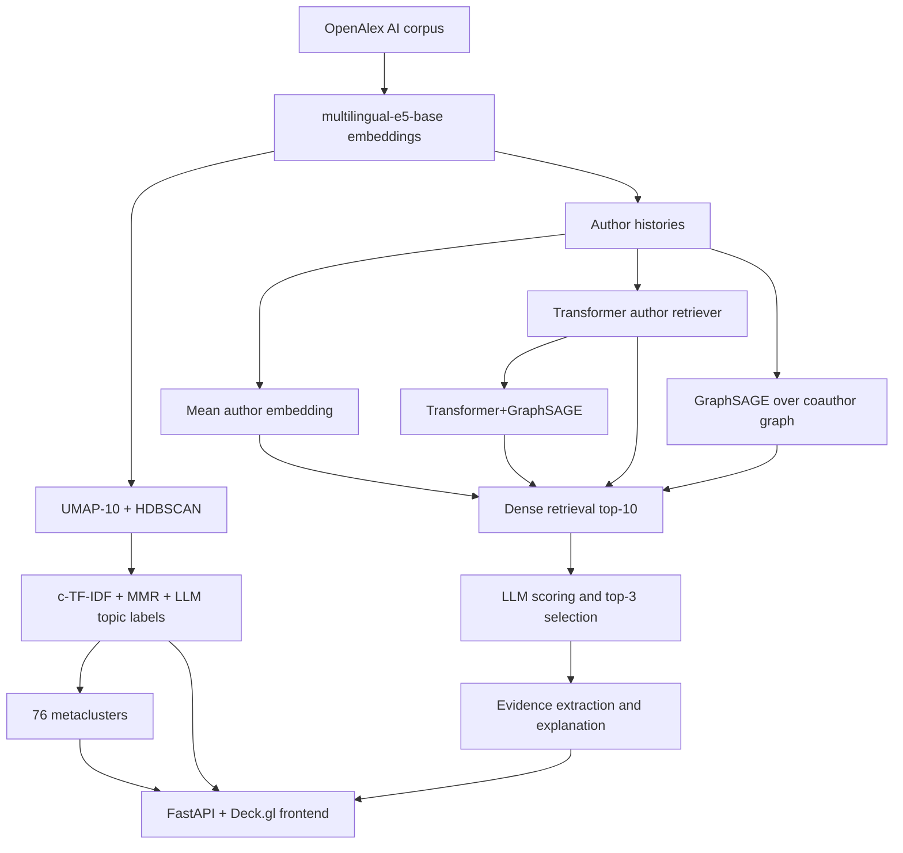

# Глава 2.1. Общая архитектура системы AI Coauthor

## Обзор

AI Coauthor построена как последовательность независимых офлайн- и онлайн-этапов. Офлайн считаются
дорогие артефакты: эмбеддинги статей, кластеры, метакластеры, модели retrieval и таблицы метрик.
Онлайн выполняется только лёгкий retrieval top-10 кандидатов, LLM-оценка, отбор 3 авторов и
генерация объяснения.

## Сквозная схема обработки

```text
OpenAlex AI corpus
  → multilingual-e5-base embeddings
  → UMAP-10 + HDBSCAN
  → c-TF-IDF + MMR + LLM labels
  → 76 metaclusters
  → author retrieval: mean / Transformer / GraphSAGE / Transformer+GraphSAGE
  → LLM reranking: score top-10, select 3
  → FastAPI + Deck.gl frontend
```

## Диаграмма потоков данных



## Состав подсистем

| Подсистема | Назначение | Код (`src/`) |
| --- | --- | --- |
| Сбор данных | Загрузка и очистка OpenAlex, сборка истории авторов | `data/` |
| Эмбеддинги | Векторизация статей и метадокументов | `embeddings/` |
| Кластеризация | UMAP, HDBSCAN, topic terms, LLM labels | `clustering/paper_topics/` |
| Метакластеры | Семантическое объединение fine-тем | `clustering/meta_topics/` |
| Рекомендации | Transformer, GraphSAGE, hybrid retrieval, LLM pipeline | `recommendation/` |
| LLM | Разметка тем и оценка рекомендаций | `llm/` |
| Оценка | Метрики кластеризации, retrieval и LLM-eval | `evaluation/` |
| Веб-приложение | FastAPI backend + Deck.gl frontend | `web/` |

## Ключевые артефакты

- `data/authors/dataset_meta.json` — параметры author dataset: 35 954 qualified authors,
  cutoff 2024, max_history 20.
- `results/selection_report.md`, `results/summary_metrics.csv` — выбор fine-кластеризации.
- `results/meta_clustering/selection_report.md` — выбор метакластеров.
- `models/author_retriever/`, `models/transformer_author_no_cluster/` — Transformer retrievers.
- `models/graphsage_author/`, `models/graphsage_author_metacluster/`,
  `models/graphsage_transformer_author/` — графовые и hybrid retrieval-модели.
- `results/final_tables/tables.md` — итоговые таблицы, синхронизированные с PDF.

Подробное описание каждого этапа — в разделе [«Этапы реализации»](../README.md#этапы-реализации-implementing_stages).
